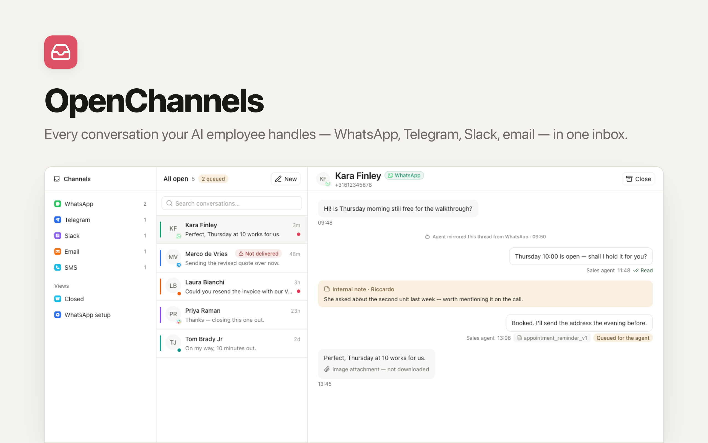

<p align="center">
  <picture>
    <source media="(prefers-color-scheme: dark)" srcset="./readme-banner-dark.png">
    
  </picture>
</p>

# OpenChannels

**Every conversation your AI employee handles — WhatsApp, Telegram, Slack, LinkedIn, email — in one inbox.**

[](https://app.clawnify.com/deploy?repo=clawnify/OpenChannels)

An open-source shared inbox built for teams whose first responder is an AI agent. Where classic shared inboxes exist so *humans* can answer everything, OpenChannels exists so a human can *review* everything: the agent triages, drafts, replies and logs what it did; you read one timeline per contact and jump in only when it matters.

## How it works

```
WhatsApp / Telegram / Slack / LinkedIn / Email
        │  (channels the agent already sits on)
        ▼
  Clawnify agent ──ingest──▶  OpenChannels (this app)
        ▲                     conversations · messages · audit trail
        └────outbox◀──────    replies you compose in the UI
```

- **Ingest** — the agent mirrors every inbound/outbound channel message into the app (`POST /api/ingest`, idempotent per channel message id). History backfill uses the same call.
- **Audit trail** — every action the agent takes on a conversation ("Booked the appointment", "Escalated to Sara") lands as a system line inside the thread.
- **Replies are agent-mediated** — hitting *Send* queues the message; the agent picks it up from `GET /api/outbox`, sends it through the channel's own tools, and confirms delivery. The app has **no channel credentials and no send path of its own**, so your channel allowlists and approval rules keep applying.
- **Internal notes** — comment inside a thread without ever messaging the contact.

## Features

- Three-pane inbox: channel navigation (live counts) → conversation list (search, unread) → thread
- Every view is a URL (`/ch/whatsapp`, `/closed`, `/c/<id>`), so back, reload and cmd-click all behave
- One conversation per contact, closed threads reopen automatically on new inbound
- Queued / sent / failed delivery states on every outgoing reply
- LinkedIn messages, connections only: the agent mirrors the LinkedIn inbox
  from its own signed-in browser and sends only messages a person wrote here.
  A person can open a thread with a 1st-degree connection; each thread takes one
  opening message, then waits for them to reply. Text only, never written by the
  agent. Daily limits (50 messages, 20 opening messages per rolling 24 hours,
  adjustable with `LINKEDIN_DAILY_MESSAGES` / `LINKEDIN_DAILY_OPENERS`) hold
  anything beyond them in the queue until there is room. LinkedIn offers no
  messaging API for member accounts, so this runs on
  your account's session; automating it is against LinkedIn's User Agreement and
  can get the account restricted, which is why the channel is kept this narrow
- Start a conversation by searching the people app you already have — point the
  inbox at it once and pick a person instead of typing a phone number. Contacts
  link to that record rather than copying it, so your CRM stays the one place a
  person's details live
- Multi-tenant by construction (org-scoped rows, platform-injected identity)
- Dark mode, agent mode (`?agent`), keyboard-friendly composer

## Deploy

Runs on the [Clawnify](https://clawnify.com) platform — the agent, channels, database and hosting come with it:

```bash
pnpm install
pnpm deploy        # → https://<slug>.apps.clawnify.com
```

Then tell your agent to read `agent.md` and start mirroring its channels.

## Local development

```bash
pnpm install
pnpm dev           # UI on :5173, API on :8787 (local SQLite)
```

The Vite proxy injects a local dev identity; seed data by curling `POST /api/ingest` with the same headers (see `agent.md` for the payload shape).

## Stack

Hono API + React + Vite over a SQLite database (Drizzle) — the standard Clawnify app template. API surface is OpenAPI-typed and self-documented at `/llms.txt` and `/api/openapi.json`.

## License

MIT

### Connect a CRM

Set the optional `CRM_APP_ID` to an OpenCRM app in the same Clawnify workspace.
The new-conversation picker can then find its contacts and retain the link to
the selected record. A profile source saved through `/api/profile-source` takes
precedence, so an existing custom people directory keeps its mapping.
